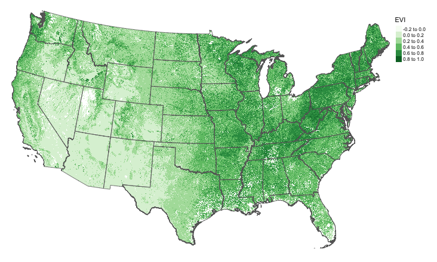

# greenspace <a href='https://degauss.org'></a>

[](https://github.com/degauss-org/greenspace/releases)
[](https://github.com/degauss-org/greenspace/actions/workflows/build-deploy-release.yaml)

## Using

If `my_address_file_geocoded.csv` is a file in the current working directory with coordinate columns named `lat` and `lon`, then the [DeGAUSS command](https://degauss.org/using_degauss.html#DeGAUSS_Commands):

```sh
docker run --rm -v $PWD:/tmp ghcr.io/degauss-org/greenspace:0.3.0 my_address_file_geocoded.csv
```

will produce `my_address_file_geocoded_greenspace_0.3.0.csv` with added columns:

- **`evi_500`**: average enhanced vegetation index within a 500 meter buffer radius
- **`evi_1500`**: average enhanced vegetation index within a 1500 meter buffer radius
- **`evi_2500`**: average enhanced vegetation index within a 2500 meter buffer radius

## Geomarker Methods

The Enhanced Vegetation Index (EVI) is a measure of greenness that ranges from -0.2 to 1, with higher values corresponding to more vegetation.

A cloud-free composite EVI raster at a resolution of 250 × 250 m was created by assembling individual images collected via remote sensing between June 10 and June 25, 2018.



## Geomarker Data

- To create the EVI raster, individual tiles were downloaded from the [LP DAAC](https://lpdaac.usgs.gov/) MOD13Q1 product and combined using the [`{MODIS}`](https://github.com/MatMatt/MODIS) R package. Then the raster was clipped and masked to the contiguous United States boundaries.

- The raster file needed to build this container is stored at [`s3://geomarker/modis_evi_ndvi/evi_June_2018_5072.tif`](https://geomarker.s3-us-east-2.amazonaws.com/modis_evi_ndvi/evi_June_2018_5072.tif)

## DeGAUSS Details

For detailed documentation on DeGAUSS, including general usage and installation, please see the [DeGAUSS homepage](https://degauss.org).